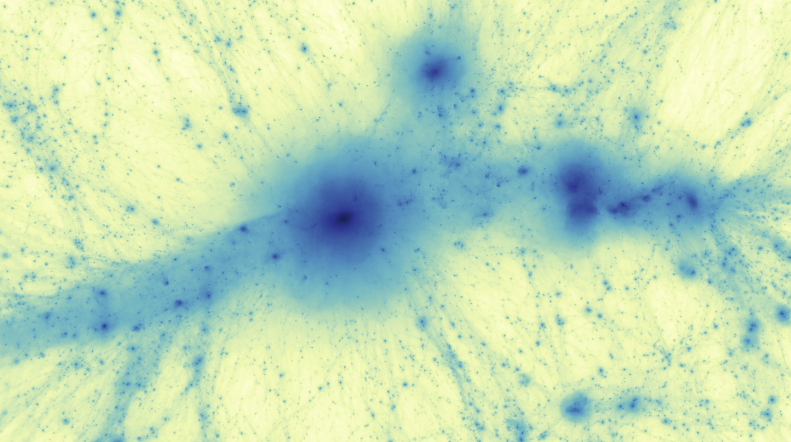

[](https://doi.org/10.21105/joss.06296)
[](https://dl.circleci.com/status-badge/redirect/gh/tberlok/paicos/tree/main)
[](
https://github.com/tberlok/paicos/actions/workflows/pylint.yml)
[](
https://github.com/tberlok/paicos/actions/workflows/flake8.yml)
[](https://paicos.readthedocs.io/en/latest/?badge=latest)


# Paicos

An object-oriented Python package for analysis of (cosmological) simulations performed
with Arepo.




# Documentation and asking for help

Installation instructions and tips on how to get started can be found
on [readthedocs](https://paicos.readthedocs.io/en/latest/?badge=latest).

If you have questions not answered there or if you simply can't get things working, then please feel free to create an issue or to send an email to tberlok ad nbi.ku.dk.

# Reporting issues and/or requesting features

Paicos uses GitHub Issues to track bugs and feature requests. Please search the existing issues before filing new issues to avoid duplicates.

# Contributing 
Contributions are very welcome indeed! Please see instructions [here](https://github.com/tberlok/paicos/blob/main/.github/CONTRIBUTING.md).

# Citing

Please cite Paicos whenever you use it for your research. A Bibtex
file can be found below:
```
@article{Berlok_Paicos_A_Python_2024,
author = {Berlok, Thomas and Jlassi, Léna and Puchwein, Ewald and Haugbølle, Troels},
doi = {10.21105/joss.06296},
journal = {Journal of Open Source Software},
month = apr,
number = {96},
pages = {6296},
title = {{Paicos: A Python package for analysis of (cosmological) simulations performed with Arepo}},
url = {https://joss.theoj.org/papers/10.21105/joss.06296},
volume = {9},
year = {2024}
}
```

